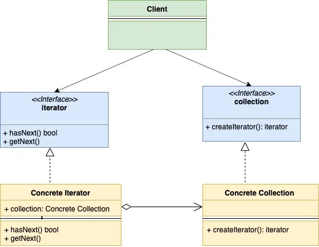

# Iterator Design Pattern in Golang

[Iterator Design Pattern in Golang](https://golangbyexample.com/go-iterator-design-pattern/)

## Introduction

Iterator design pattern is a behavioral design pattern. In this pattern, the collection struct provides an iterator which lets it go through each element in the collection struct in sequence without exposing its underlying implementation.
Below are basic components of the Iterator Design Pattern

- **Iterator Interface** : this interface provides basic operations such as **hasNext()**, **getNext()** etc. These operations as the name suggests lets you traverse a collection, restarting iteration, etc

- **Collection interface**: this interface represents the collection that needs to be traversed. This interface defines a method **createIterator()** which returns **iterator** type

- **Concrete Iterator:** the concrete implementation of iterator interface

- **Concrete Collection**: the concrete implementation of Collection interface

The main idea behind this pattern is to expose the iteration logic of a Collection struct into a different object (which implements the iterator interface). This iterator provides a generic method of iterating over a collection independent of its type.

## UML Diagram



## Mapping

The below table represents the mapping from the UML diagram actors to actual implementation actors in **“Example”** below

| Role                | File              |
| ------------------- | ----------------- |
| Collection          | collection.go     |
| Concrete Collection | usercollection.go |
| Iterator            | mac.go            |
| Concrete Iterator 1 | useriterator.go   |
| Client              | main.go           |

## Example

**collection.go**

```go
package main

type collection interface {
    createIterator() iterator
}
```

**usercollection.go**

```go
package main

type userCollection struct {
    users []*user
}

func (u *userCollection) createIterator() iterator {
    return &userIterator{
        users: u.users,
    }
}
```

**iterator.go**

```go
package main

type iterator interface {
    hasNext() bool
    getNext() *user
}
```

**useriterator.go**

```go
package main

type userIterator struct {
    index int
    users []*user
}

func (u *userIterator) hasNext() bool {
    if u.index < len(u.users) {
        return true
    }
    return false
}

func (u *userIterator) getNext() *user {
    if u.hasNext() {
        user := u.users[u.index]
        u.index++
        return user
    }
    return nil
}
```

**user.go**

```go
package main

type user struct {
    name string
    age  int
}
```

**main.go**

```go
package main

import "fmt"

func main() {
    user1 := &user{
        name: "a",
        age:  30,
    }
    user2 := &user{
        name: "b",
        age:  20,
    }
    userCollection := &userCollection{
        users: []*user{user1, user2},
    }
    iterator := userCollection.createIterator()
    for iterator.hasNext() {
        user := iterator.getNext()
        fmt.Printf("User is %+v\n", user)
    }
}
```

**Output:**

```go
User is &{name:a age:30}
User is &{name:b age:20}
```

## Full Working Code

```go
package main

import "fmt"

type collection interface {
    createIterator() iterator
}

type userCollection struct {
    users []*user
}

func (u *userCollection) createIterator() iterator {
    return &userIterator{
        users: u.users,
    }
}

type iterator interface {
    hasNext() bool
    getNext() *user
}

type userIterator struct {
    index int
    users []*user
}

func (u *userIterator) hasNext() bool {
    if u.index < len(u.users) {
        return true
    }
    return false
}

func (u *userIterator) getNext() *user {
    if u.hasNext() {
        user := u.users[u.index]
        u.index++
        return user
    }
    return nil
}

type user struct {
    name string
    age  int
}

func main() {
    user1 := &user{
        name: "a",
        age:  30,
    }
    user2 := &user{
        name: "b",
        age:  20,
    }
    userCollection := &userCollection{
        users: []*user{user1, user2},
    }
    iterator := userCollection.createIterator()
    for iterator.hasNext() {
        user := iterator.getNext()
        fmt.Printf("User is %+v\n", user)
    }
}
```

**Output:**

```go
User is &{name:a age:30}
User is &{name:b age:20}
```
