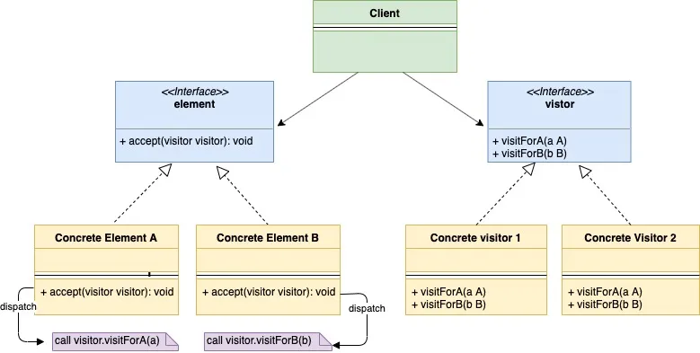
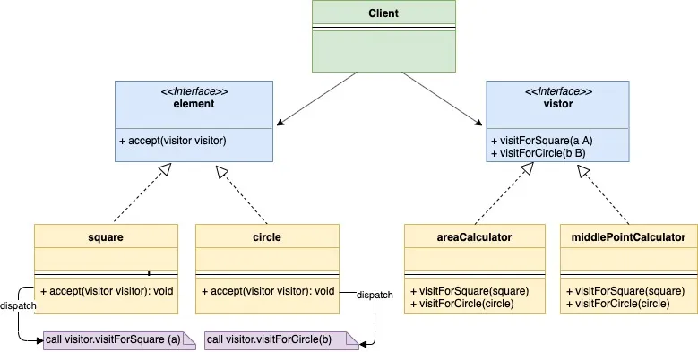

# Visitor Design Pattern in Go(Golang)

[Visitor Design Pattern in Go(Golang)](https://golangbyexample.com/visitor-design-pattern-go/)

## Introduction

Visitor Design Pattern is a Behavioural design pattern that lets you add behaviour to a struct without actually modifying the struct.
Let’s understand the visitor pattern with an example. Let’s say you are the maintainer of a lib which has different shape structs such as

1. Square
2. Circle
3. Triangle

Each of the above shape structs implements a common interface **shape.** There are many teams in your company which are using your lib. Now let’s say one of the team wants you to add one more behaviour (**getArea()**) to the Shape structs.

There are many options to solve this problem

**First Option**

The first option that comes to the mind is to add **getArea()** method in the **shape** interface and then each shape struct can implement the getArea() method. This seems trivial but there are some problems:

- As a maintainer of the library, you don’t want to alter a highly tested code of your library by adding additional behaviours.
- There might be more request by the teams using your library for more behaviours such as **getNumSides()**, **getMiddleCoordinates()**. Then, in this case, you don’t want to keep modifying your library. But you do want other teams to extend your library without actual modification of the code much.

**Second Option**

The second option is that the team requesting the feature can write the logic for behaviour themselves. So based upon the shape struct type they like below code

```go
if shape.type == square {
   //Calculate area for squre
} elseif shape.type == circle {
    //Calculate area of circle 
} elseif shape.type == triangle {
    //Calculate area of triangle
} else {
   //Raise error
} 
```

Above code is also problematic as you are not able to take the full advantage of interfaces and instead do an explicit type checking which is fragile. Second, getting the type at run time may have a performance impact or maybe even not possible in some languages.

**Third Option**

The third option is to solve the above problem using the visitor pattern. We define a visitor interface like below

```go
type visitor interface {
   visitForSquare(square)
   visitForCircle(circle)
   visitForTriangle(triangle)
}
```

The functions **visitforSquare(square), visitForCircle(circle), visitForTriangle(triangle)** allows us to add functionality to Square, Circle and Triangle respectively.

Now the question which comes to mind is why can’t we have a single method visit**(shape)** in the visitor interface. The reason we don’t have it because GO and also some other languages don't support method overloading. So a different method for each of the struct.

We add an **accept** method to the shape interface with below signature and each of the shape struct needs to define this method.

```go
func accept(v visitor)
```

But wait for a second, we just mentioned that we don’t want to modify our existing shape structs. But when using Visitor Pattern we do have to modify our shape structs but this modification will only be done once. In case adding any additional behaviour such as **getNumSides()**, **getMiddleCoordinates()** will use the same above **accept(v visitor)** function without any further change to the shape structs. Basically the shape structs just need to be modified once and all future request of additional behaviours will be handled using the same accept function. Let’s see how.

The square struct will implement an accept method like below:

```go
func (obj *squre) accept(v visitor){
    v.visitForSquare(obj)
}
```

and similarly, circle and triangle will also define an accept function as above.

Now the team requesting for the **getArea()** behaviour can simply define the concrete implementation of visitor interface and write the area calculation logic in that concrete implementation.

**areacalculator.go**

```go
type areaCalculator struct{
    area int
}

func (a *areaCalculator) visitForSquare(s *square){
    //Calculate are for square
}
func (a *areaCalculator) visitForCircle(s *square){
    //Calculate are for circle
}
func (a *areaCalculator) visitForTriangle(s *square){
    //Calculate are for triangle
}
```

To calculate the area of a square we first create an instance of the square they can simply call.

```none
sq := &square{}
ac := &areaCalculator{}
sq.accept(ac)
```

Similarly, other team requesting for **getMiddleCoordinates()** behaviour can define another concrete implementation of the visitor interface similar to above.

**middlecoordinates.go**

```go
type middleCoordinates struct {
    x int
    y int
}

func (a *middleCoordinates) visitForSquare(s *square) {
    //Calculate middle point coordinates for square. After calculating the area assign in to the x and y instance variable.
}

func (a *middleCoordinates) visitForCircle(c *circle) {
    //Calculate middle point coordinates for square. After calculating the area assign in to the x and y instance variable.
}

func (a *middleCoordinates) visitForTriangle(t *triangle) {
    //Calculate middle point coordinates for square. After calculating the area assign in to the x and y instance variable.
}
```

## UML Diagram



Below is the corresponding mapping UML diagram with the practical example of shape struct and areaCalculator we gave above



## Mapping

The below table represents the mapping from the UML diagram actors to actual implementation actors in **“Example”** below

| Role               | File                 |
| ------------------ | -------------------- |
| element            | shape.go             |
| Concrete Element A | square.go            |
| Concrete Element B | circle.go            |
| Concrete Element C | rectangle.go         |
| Visitor            | visitor.go           |
| Concrete Visitor 1 | areacalculator.go    |
| Concrete Visitor 2 | middlecoordinates.go |
| Client             | main.go              |

## Example

**shape.go**

```go
package main

type shape interface {
    getType() string
    accept(visitor)
}
```

**square.go**

```go
package main

type square struct {
    side int
}

func (s *square) accept(v visitor) {
    v.visitForSquare(s)
}

func (s *square) getType() string {
    return "Square"
}
```

**circle.go**

```go
package main

type circle struct {
    radius int
}

func (c *circle) accept(v visitor) {
    v.visitForCircle(c)
}

func (c *circle) getType() string {
    return "Circle"
}
```

**rectangle.go**

```go
package main

type rectangle struct {
    l int
    b int
}

func (r *rectangle) accept(v visitor) {
    v.visitForRectangle(r)
}

func (r *rectangle) getType() string {
    return "Rectangle"
}
```

**visitor.go**

```go
package main

type visitor interface {
    visitForSquare(*square)
    visitForCircle(*circle)
    visitForRectangle(*rectangle)
}
```

**areacalculator.go**

```go
package main

import "fmt"

type areaCalculator struct {
    area int
}

func (a *areaCalculator) visitForSquare(s *square) {
    // Calculate area for square. After calculating the area assign in to the area instance variable
    fmt.Println("Calculating area for square")
}

func (a *areaCalculator) visitForCircle(c *circle) {
    // Calculate are for circle. After calculating the area assign in to the area instance variable
    fmt.Println("Calculating area for circle")
}

func (a *areaCalculator) visitForRectangle(r *rectangle) {
    // Calculate are for rectangle. After calculating the area assign in to the area instance variable
    fmt.Println("Calculating area for rectangle")
}
```

**middlecoordinates.go**

```go
package main

import "fmt"

type middleCoordinates struct {
    x int
    y int
}

func (m *middleCoordinates) visitForSquare(s *square) {
    // Calculate middle point coordinates for square. After calculating the area assign in to the x and y instance variable.
    fmt.Println("Calculating middle point coordinates for square")
}

func (m *middleCoordinates) visitForCircle(c *circle) {
    // Calculate middle point coordinates for square. After calculating the area assign in to the x and y instance variable.
    fmt.Println("Calculating middle point coordinates for circle")
}

func (m *middleCoordinates) visitForRectangle(r *rectangle) {
    // Calculate middle point coordinates for square. After calculating the area assign in to the x and y instance variable.
    fmt.Println("Calculating middle point coordinates for rectangle")
}
```

**main.go**

```go
package main

import "fmt"

func main() {
    square := &square{side: 2}
    circle := &circle{radius: 3}
    rectangle := &rectangle{l: 2, b: 3}
   
    areaCalculator := &areaCalculator{}
    square.accept(areaCalculator)
    circle.accept(areaCalculator)
    rectangle.accept(areaCalculator)
   
    fmt.Println()
    middleCoordinates := &middleCoordinates{}
    square.accept(middleCoordinates)
    circle.accept(middleCoordinates)
    rectangle.accept(middleCoordinates)
}
```

**Output:**

```go
Calculating area for square
Calculating area for circle
Calculating area for rectangle

Calculating middle point coordinates for square
Calculating middle point coordinates for circle
Calculating middle point coordinates for rectangle
```

## Full Working Code

```go
package main

import "fmt"

type shape interface {
    getType() string
    accept(visitor)
}

type square struct {
    side int
}

func (s *square) accept(v visitor) {
    v.visitForSquare(s)
}

func (s *square) getType() string {
    return "Square"
}

type circle struct {
    radius int
}

func (c *circle) accept(v visitor) {
    v.visitForCircle(c)
}

func (c *circle) getType() string {
    return "Circle"
}

type rectangle struct {
    l int
    b int
}

func (r *rectangle) accept(v visitor) {
    v.visitForRectangle(r)
}

func (r *rectangle) getType() string {
    return "Rectangle"
}

type visitor interface {
    visitForSquare(*square)
    visitForCircle(*circle)
    visitForRectangle(*rectangle)
}

type areaCalculator struct {
    area int
}

func (a *areaCalculator) visitForSquare(s *square) {
    // Calculate area for square. After calculating the area assign in to the area instance variable
    fmt.Println("Calculating area for square")
}

func (a *areaCalculator) visitForCircle(c *circle) {
    // Calculate are for circle. After calculating the area assign in to the area instance variable
    fmt.Println("Calculating area for circle")
}

func (a *areaCalculator) visitForRectangle(r *rectangle) {
    // Calculate are for rectangle. After calculating the area assign in to the area instance variable
    fmt.Println("Calculating area for rectangle")
}

type middleCoordinates struct {
    x int
    y int
}

func (m *middleCoordinates) visitForSquare(s *square) {
    // Calculate middle point coordinates for square. After calculating the area assign in to the x and y instance variable.
    fmt.Println("Calculating middle point coordinates for square")
}

func (m *middleCoordinates) visitForCircle(c *circle) {
    // Calculate middle point coordinates for square. After calculating the area assign in to the x and y instance variable.
    fmt.Println("Calculating middle point coordinates for circle")
}

func (m *middleCoordinates) visitForRectangle(r *rectangle) {
    // Calculate middle point coordinates for square. After calculating the area assign in to the x and y instance variable.
    fmt.Println("Calculating middle point coordinates for rectangle")
}

func main() {
    square := &square{side: 2}
    circle := &circle{radius: 3}
    rectangle := &rectangle{l: 2, b: 3}
    areaCalculator := &areaCalculator{}
    square.accept(areaCalculator)
    circle.accept(areaCalculator)
    rectangle.accept(areaCalculator)
    
    fmt.Println()
    middleCoordinates := &middleCoordinates{}
    square.accept(middleCoordinates)
    circle.accept(middleCoordinates)
    rectangle.accept(middleCoordinates)
}
```

**Output:**

```go
Calculating area for square
Calculating area for circle
Calculating area for rectangle

Calculating middle point coordinates for square
Calculating middle point coordinates for circle
Calculating middle point coordinates for rectangle
```
