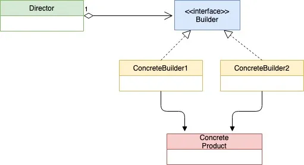

# Builder Design Pattern

[Builder Pattern in GoLang](https://golangbyexample.com/builder-pattern-golang/)

## Definition

Builder Pattern is a creational design pattern used for constructing complex objects. Below is the UML diagram.

## UML Diagram



## Mapping (Also Refer 5th point – Example)

| Role               | File             |
| ------------------ | ---------------- |
| Director           | director.go      |
| Builder Interface  | ibuilder.go      |
| Concrete Builder 1 | normalbuilder.go |
| Concrete Builder 2 | igloobuilder.go  |
| Product            | house.go         |

## When To Use

- Use Builder pattern when the object constructed is big and requires multiple steps. It helps in less size of the constructor. The construction of the house becomes simple and it does not require a large constructor

- When a different version of the same product needs to be created. For example, in the below code we see a different version of house ie. igloo and the normal house being constructed by **iglooBuilder** and **normalBuilder**

- When half constructed final object should not exist. Again referring to below code the house created will either be created fully or not created at all. The Concrete Builder struct holds the temporary state of house object being created

## Example

**ibuilder.go**

```go
package main

type iBuilder interface {
    setWindowType()
    setDoorType()
    setNumFloor()
    getHouse() house
}

func getBuilder(builderType string) iBuilder {
    if builderType == "normal" {
        return &normalBuilder{}
    }
    if builderType == "igloo" {
        return &iglooBuilder{}
    }
    return nil
}
```

**normalbuilder.go**

```go
package main

type normalBuilder struct {
    windowType string
    doorType   string
    floor      int
}

func newNormalBuilder() *normalBuilder {
    return &normalBuilder{}
}

func (b *normalBuilder) setWindowType() {
    b.windowType = "Wooden Window"
}

func (b *normalBuilder) setDoorType() {
    b.doorType = "Wooden Door"
}

func (b *normalBuilder) setNumFloor() {
    b.floor = 2
}

func (b *normalBuilder) getHouse() house {
    return house{
        doorType:   b.doorType,
        windowType: b.windowType,
        floor:      b.floor,
    }
}
```

**igloobuilder.go**

```go
package main

type iglooBuilder struct {
    windowType string
    doorType   string
    floor      int
}

func newIglooBuilder() *iglooBuilder {
    return &iglooBuilder{}
}

func (b *iglooBuilder) setWindowType() {
    b.windowType = "Snow Window"
}

func (b *iglooBuilder) setDoorType() {
    b.doorType = "Snow Door"
}

func (b *iglooBuilder) setNumFloor() {
    b.floor = 1
}

func (b *iglooBuilder) getHouse() house {
    return house{
        doorType:   b.doorType,
        windowType: b.windowType,
        floor:      b.floor,
    }
}
```

**house.go**

```go
package main

type house struct {
    windowType string
    doorType   string
    floor      int
}
```

**director.go**

```go
package main

type director struct {
    builder iBuilder
}

func newDirector(b iBuilder) *director {
    return &director{
        builder: b,
    }
}

func (d *director) setBuilder(b iBuilder) {
    d.builder = b
}

func (d *director) buildHouse() house {
    d.builder.setDoorType()
    d.builder.setWindowType()
    d.builder.setNumFloor()
    return d.builder.getHouse()
}
```

**main.go**

```go
package main

import "fmt"

func main() {
    normalBuilder := getBuilder("normal")
    iglooBuilder := getBuilder("igloo")

    director := newDirector(normalBuilder)
    normalHouse := director.buildHouse()

    fmt.Printf("Normal House Door Type: %s\n", normalHouse.doorType)
    fmt.Printf("Normal House Window Type: %s\n", normalHouse.windowType)
    fmt.Printf("Normal House Num Floor: %d\n", normalHouse.floor)

    director.setBuilder(iglooBuilder)
    iglooHouse := director.buildHouse()

    fmt.Printf("\nIgloo House Door Type: %s\n", iglooHouse.doorType)
    fmt.Printf("Igloo House Window Type: %s\n", iglooHouse.windowType)
    fmt.Printf("Igloo House Num Floor: %d\n", iglooHouse.floor)
}
```

**Output:**

```go
Normal House Door Type: Wooden Door
Normal House Window Type: Wooden Window
Normal House Num Floor: 2

Igloo House Door Type: Snow Door
Igloo House Window Type: Snow Window
Igloo House Num Floor: 1
```
