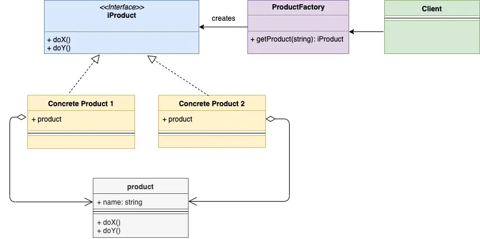
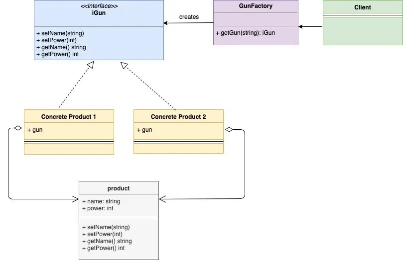

# Factory Design Pattern

[Factory Design Pattern in Go (Golang)](https://golangbyexample.com/golang-factory-design-pattern/)

## Introduction

Factory design pattern is a creational design pattern and it is also one of the most commonly used pattern. This pattern provides a way to hide the creation logic of the instances being created.

The client only interacts with a factory struct and tells the kind of instances that needs to be created. The factory class interacts with the corresponding concrete structs and returns the correct instance back.

In below example

- We have **iGun** interface which defines all methods a gun should have
- There is **gun** struct that implements the **iGun** interface.
- Two concrete guns **ak47** and **maverick**. Both embed **gun** struct and hence also indirectly implement all methods of **iGun** and hence are of **iGun** type
- We have a **gunFactory** struct which creates the gun of type **ak47** or **maverick**.
- The **main.go** acts as a client and instead of directly interacting with **ak47** or **maverick**, it relies on **gunFactory** to create instances of **ak47** and **maverick**

## UML Diagram



Below is the corresponding mapping UML diagram with the example given above



## Mapping

The below table represents the mapping from the UML diagram actors to actual implementation actors in **“Example”** below

| Role                | File          |
| ------------------- | ------------- |
| ProductFactory      | gunfactory.go |
| iProduct            | igun.go       |
| Product             | gun.go        |
| Concrete iProduct 1 | ak47go        |
| Concrete iProduct 1 | maverick.go   |
| Client              | main.go       |

## Example

**igun.go**

```go
package main

type iGun interface {
    setName(name string)
    setPower(power int)
    getName() string
    getPower() int
}
```

**gun.go**

```go
package main

type gun struct {
    name  string
    power int
}

func (g *gun) setName(name string) {
    g.name = name
}

func (g *gun) getName() string {
    return g.name
}

func (g *gun) setPower(power int) {
    g.power = power
}

func (g *gun) getPower() int {
    return g.power
}
```

**ak47.go**

```go
package main

type ak47 struct {
    gun
}

func newAk47() iGun {
    return &ak47{
        gun: gun{
            name:  "AK47 gun",
            power: 4,
        },
    }
}
```

**maverick.go**

```go
package main

type maverick struct {
    gun
}

func newMaverick() iGun {
    return &maverick{
        gun: gun{
            name:  "Maverick gun",
            power: 5,
        },
    }
}
```

**gunfactory.go**

```go
package main

import "fmt"

func getGun(gunType string) (iGun, error) {
    if gunType == "ak47" {
        return newAk47(), nil
    }
    if gunType == "maverick" {
        return newMaverick(), nil
    }
    return nil, fmt.Errorf("Wrong gun type passed")
}
```

**main.go**

```go
package main

import "fmt"

func main() {
    ak47, _ := getGun("ak47")
    maverick, _ := getGun("maverick")
    printDetails(ak47)
    printDetails(maverick)
}

func printDetails(g iGun) {
    fmt.Printf("Gun: %s", g.getName())
    fmt.Println()
    fmt.Printf("Power: %d", g.getPower())
    fmt.Println()
}
```

**Output:**

```go
Gun: AK47 gun
Power: 4
Gun: Maverick gun
Power: 5
```

## Full Working Code

```go
package main

import "fmt"

type iGun interface {
    setName(name string)
    setPower(power int)
    getName() string
    getPower() int
}

type gun struct {
    name  string
    power int
}

func (g *gun) setName(name string) {
    g.name = name
}

func (g *gun) getName() string {
    return g.name
}

func (g *gun) setPower(power int) {
    g.power = power
}

func (g *gun) getPower() int {
    return g.power
}

type ak47 struct {
    gun
}

func newAk47() iGun {
    return &ak47{
        gun: gun{
            name:  "AK47 gun",
            power: 4,
        },
    }
}

type maverick struct {
    gun
}

func newMaverick() iGun {
    return &maverick{
        gun: gun{
            name:  "Maverick gun",
            power: 5,
        },
    }
}

func getGun(gunType string) (iGun, error) {
    if gunType == "ak47" {
        return newAk47(), nil
    }
    if gunType == "maverick" {
        return newMaverick(), nil
    }
    return nil, fmt.Errorf("Wrong gun type passed")
}

func main() {
    ak47, _ := getGun("ak47")
    maverick, _ := getGun("maverick")
    printDetails(ak47)
    printDetails(maverick)
}

func printDetails(g iGun) {
    fmt.Printf("Gun: %s", g.getName())
    fmt.Println()
    fmt.Printf("Power: %d", g.getPower())
    fmt.Println()
}
```

**Output:**

```go
Gun: AK47 gun
Power: 4
Gun: Maverick gun
Power: 5
```
