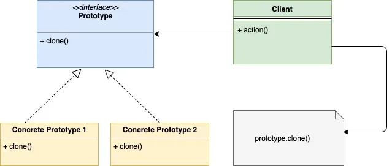

# Prototype Design Pattern

[Prototype Pattern in Go (Golang)](https://golangbyexample.com/prototype-pattern-go/)

## Definition

It is a creational design pattern that lets you create copies of objects. In this pattern, the responsibility of creating the clone objects is delegated to the actual object to clone.

The object to be cloned exposes a clone method which returns a clone copy of the object

## When to Use

- We use prototype pattern when the object to be cloned creation process is complex i.e the cloning may involve vases of handling deep copies, hierarchical copies, etc. Moreover, there may be some private members too which cannot be directly accessed.
- A copy of the object is created instead of creating a new instance from scratch. This prevents costly operations involved while creating a new object such as database operation.
- When you want to create a copy of a new object, but it is only available to you as an interface. Hence you cannot directly create copies of that object.

## UML Diagram



## Mapping

The below table represents the mapping from the UML diagram actors to actual implementation actors in code.

| Role                 | File      |
| -------------------- | --------- |
| prototype interface  | inode.go  |
| Concrete Prototype 1 | file.go   |
| Concrete Prototype 2 | folder.go |
| client               | main.go   |

## Practical Example

In the context of golang let’s try to understand it with an example of os file system. The os file system has files and folders and folders itself contain files and folders. Each **file** and **folder** can be represented by an **inode** interface. **inode** interface also has the **clone**() function.

**inode.go**

```go
package main

type inode interface {
    print(string)
    clone() inode
}
```

**file** struct is represented as

**file.go**

```go
package main

import "fmt"

type file struct {
    name string
}

func (f *file) print(indentation string) {
    fmt.Println(indentation + f.name)
}

func (f *file) clone() inode {
    return &file{name: f.name + "_clone"}
}
```

**folder** struct is represented as

**folder.go**

```go
package main

import "fmt"

type folder struct {
    childrens []inode
    name      string
}

func (f *folder) print(indentation string) {
    fmt.Println(indentation + f.name)
    for _, i := range f.childrens {
        i.print(indentation + indentation)
    }
}

func (f *folder) clone() inode {
    cloneFolder := &folder{name: f.name + "_clone"}
    var tempChildrens []inode
    for _, i := range f.childrens {
        copy := i.clone()
        tempChildrens = append(tempChildrens, copy)
    }
    cloneFolder.childrens = tempChildrens
    return cloneFolder
}
```

Since both **file** and **folder** struct implements the **print** and **clone** functions, hence they are of type **inode**. Also, notice the **clone** function in both file and folder. The **clone** function in both of them returns a copy of the respective file or folder. While cloning we append the keyword “_clone” for the name field. Let’s write the main function to test things out.

**main.go**

```go
package main

import "fmt"

func main() {
    file1 := &file{name: "File1"}
    file2 := &file{name: "File2"}
    file3 := &file{name: "File3"}
    folder1 := &folder{
        childrens: []inode{file1},
        name:      "Folder1",
    }
    folder2 := &folder{
        childrens: []inode{folder1, file2, file3},
        name:      "Folder2",
    }
    fmt.Println("\nPrinting hierarchy for Folder2")
    folder2.print("  ")
    cloneFolder := folder2.clone()
    fmt.Println("\nPrinting hierarchy for clone Folder")
    cloneFolder.print("  ")
}
```

**Output:**

```go
Printing hierarchy for Folder2
  Folder2
    Folder1
        File1
    File2
    File3

Printing hierarchy for clone Folder
  Folder2_clone
    Folder1_clone
        File1_clone
    File2_clone
    File3_clone
```
