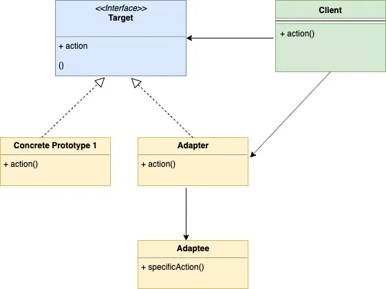
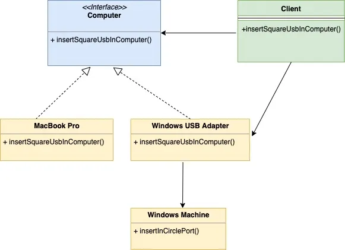

# Adapter Design Pattern

[Adapter Design Pattern in Go (GoLang)](https://golangbyexample.com/adapter-design-pattern-go/)

## Introduction

This design pattern is a Structural Design Pattern. The pattern is best understood with an example. Let’s say you have two laptops

1. MacBook Pro
2. Windows Laptop

MacBook Pro has a USB port that is **square** in shape and Windows have a USB port that is **circular** in shape. You as a client have a USB cable that is square in shape so it can only be inserted in the mac laptop. So you see the problem here

**Problem:**

- We have a class (Client) that is expecting some features of an object (square USB port here), but we have another object called adaptee (Windows Laptop here) which offers the same functionality but through a different interface(circular port)

This is where Adapter Pattern comes into the picture. We create a class known as Adapter that will

- Adhere to the same interface which client expects (Square USB port here)
- Translate the request from the client to the adaptee in the form that adaptee expects. Basically, in our example act as an adapter that accepts USB in square port and then inserts into circular port in windows laptop.

## When to Use

- Use this design pattern when the objects implement a different interface as required by the client.

## UML Diagram



Below is the corresponding mapping UML diagram with the example given above



## Mapping

The below table represents the mapping from the UML diagram actors to actual implementation actors in code.

| Role                           | File              |
| ------------------------------ | ----------------- |
| Target                         | computer.go       |
| Concrete Prototype 1           | mac.go            |
| Concrete Prototype 2 (Adapter) | windowsadapter.go |
| adaptee                        | windows.go        |
| client                         | client.go         |

## Example

**computer.go**

```go
package main

type computer interface {
    insertInSquarePort()
}
```

**mac.go**

```go
package main

import "fmt"

type mac struct {
}

func (m *mac) insertInSquarePort() {
    fmt.Println("Insert square port into mac machine")
}
```

**windowsadapter.go**

```go
package main

type windowsAdapter struct {
    windowsMachine *windows
}

func (w *windowsAdapter) insertInSquarePort() {
    w.windowsMachine.insertInCirclePort()
}
```

**windows.go**

```go
package main

import "fmt"

type windows struct{}

func (w *windows) insertInCirclePort() {
    fmt.Println("Insert circle port into windows machine")
}
```

**client.go**

```go
package main

type client struct {
}

func (c *client) insertSquareUsbInComputer(com computer) {
    com.insertInSquarePort()
}
```

**main.go**

```go
package main

func main() {
    client := &client{}
    mac := &mac{}
    client.insertSquareUsbInComputer(mac)
    windowsMachine := &windows{}
    windowsMachineAdapter := &windowsAdapter{
        windowsMachine: windowsMachine,
    }
    client.insertSquareUsbInComputer(windowsMachineAdapter)
}
```

**Output:**

```go
Insert square port into mac machine
Insert circle port into windows machine
```
