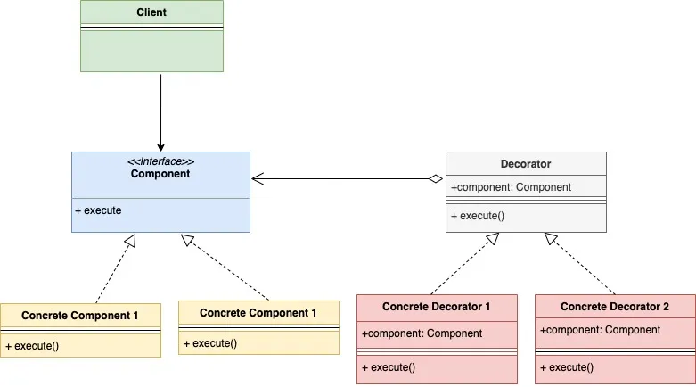

# Decorator design pattern

[Decorator design pattern in Go (Golang)](https://golangbyexample.com/decorator-pattern-golang/)

## Overview

Decorator design pattern is a structural design pattern. It lets you provide additional functionality or decorates an object without altering that object.

It is better understood with an example. Imagine you are opening a pizza chain. You started with two kinds of pizzas

- Veggie Mania Pizza
- Peppy Tofu pizza

Each of the above pizza had its price. So you would create a pizza interface as below

```go
package main

type pizza interface {
    getPrice() int
}
```

You need to also create two pizza struct with a **getPrice** function which will return the price. These two pizza structs implement the pizza interface as they define the getPrice() method

Later on, you started to offer toppings along with the pizza with some additional price for each of the topping. So the original base pizza now needs to be decorated with a topping. Imaging you added below two toppings to the menu

- Tomato Topping
- Cheese Topping

Also, remember that pizza along with the topping is also a pizza. Customer can choose their pizza in different ways. For eg

- Veggie mania with tomato topping
- Veggie main with tomato and cheese topping
- Peppy Paneer pizza without any topping
- Peppy Paneer pizza with cheese topping
- …

So how would you design now given that you now have the toppings as well. Decorator pattern will come into picture. It can help additional functionality without actually modifying any of the existing structs. Decorator pattern recommends in this case to create separate structs for each of the topping available. Each topping struct will implement the pizza interface above and also have an embed and instance of pizza.

We now have separate structs for different types of pizza and separate struct for the types of topping available. Each of the pizza and topping has its own price. And whenever you add any topping to a pizza then price of that topping is added to the price of base pizza and that is how you get a resultant price.

So the decorator pattern let’s you decorate the original base pizza object without altering that pizza object. The pizza object knows nothing about toppings. It just knows its price and nothing else.

## UML Diagram

Below is UML diagram for the decorator design pattern



The concrete component (**Veggie Mania** and **Peppy Tofu** here) and concrete decorator (**Toppings** here) implement the component interface (**Pizza** here). Also concrete decorator would embed an instance of component as well.

As in below example we have

- The component is represented by pizza interface

- The concrete component is represented by **veggieMania** and **peppyPanner** **struct**. They both implement the pizza interface

- Concrete decorators are represented by cheeseTopping and tomatoTopping struct. They both implement the pizza interface. Also, they embed an instance of type **pizza** as well

## Code

**pizza.go**

```go
package main

type pizza interface {
    getPrice() int
}
```

**peppypaneer.go**

```go
package main

type peppyPaneer struct {
}

func (p *peppyPaneer) getPrice() int {
    return 20
}
```

**veggiemania.go**

```go
package main

type veggieMania struct {
}

func (p *veggieMania) getPrice() int {
    return 15
}
```

**cheesetopping.go**

```go
package main

type cheeseTopping struct {
    pizza pizza
}

func (c *cheeseTopping) getPrice() int {
    pizzaPrice := c.pizza.getPrice()
    return pizzaPrice + 10
}
```

**tomatotopping.go**

```go
package main

type tomatoTopping struct {
    pizza pizza
}

func (c *tomatoTopping) getPrice() int {
    pizzaPrice := c.pizza.getPrice()
    return pizzaPrice + 7
}
```

**main.go**

```go
package main

import "fmt"

func main() {
    veggiePizza := &veggieMania{}

    // Add cheese topping
    veggiePizzaWithCheese := &cheeseTopping{
        pizza: veggiePizza,
    }

    // Add tomato topping
    veggiePizzaWithCheeseAndTomato := &tomatoTopping{
        pizza: veggiePizzaWithCheese,
    }

    fmt.Printf("Price of veggieMania pizza with tomato and cheese topping is %d\n", veggiePizzaWithCheeseAndTomato.getPrice())

    peppyPaneerPizza := &peppyPaneer{}

    // Add cheese topping
    peppyPaneerPizzaWithCheese := &cheeseTopping{
        pizza: peppyPaneerPizza,
    }

    fmt.Printf("Price of peppyPaneer with tomato and cheese topping is %d\n", peppyPaneerPizzaWithCheese.getPrice())
}
```

**Output**

```go
Price of veggieMania pizza with tomato and cheese topping is 32
Price of peppyPaneer with tomato and cheese topping is 30
```

## Full Working Code

```go
package main

import "fmt"

type pizza interface {
    getPrice() int
}

type peppyPaneer struct {
}

func (p *peppyPaneer) getPrice() int {
    return 20
}

type veggieMania struct {
}

func (p *veggieMania) getPrice() int {
    return 15
}

type tomatoTopping struct {
    pizza pizza
}

func (c *tomatoTopping) getPrice() int {
    pizzaPrice := c.pizza.getPrice()
    return pizzaPrice + 7
}

type cheeseTopping struct {
    pizza pizza
}

func (c *cheeseTopping) getPrice() int {
    pizzaPrice := c.pizza.getPrice()
    return pizzaPrice + 10
}

func main() {
    veggiePizza := &veggieMania{}

    // Add cheese topping
    veggiePizzaWithCheese := &cheeseTopping{
        pizza: veggiePizza,
    }

    // Add tomato topping
    veggiePizzaWithCheeseAndTomato := &tomatoTopping{
        pizza: veggiePizzaWithCheese,
    }

    fmt.Printf("Price of veggieMania pizza with tomato and cheese topping is %d\n", veggiePizzaWithCheeseAndTomato.getPrice())

    peppyPaneerPizza := &peppyPaneer{}

    // Add cheese topping
    peppyPaneerPizzaWithCheese := &cheeseTopping{
        pizza: peppyPaneerPizza,
    }

    fmt.Printf("Price of peppyPaneer with tomato and cheese topping is %d\n", peppyPaneerPizzaWithCheese.getPrice())
}
```

**Output**

```go
Price of veggieMania pizza with tomato and cheese topping is 32
Price of peppyPaneer with tomato and cheese topping is 30
```
